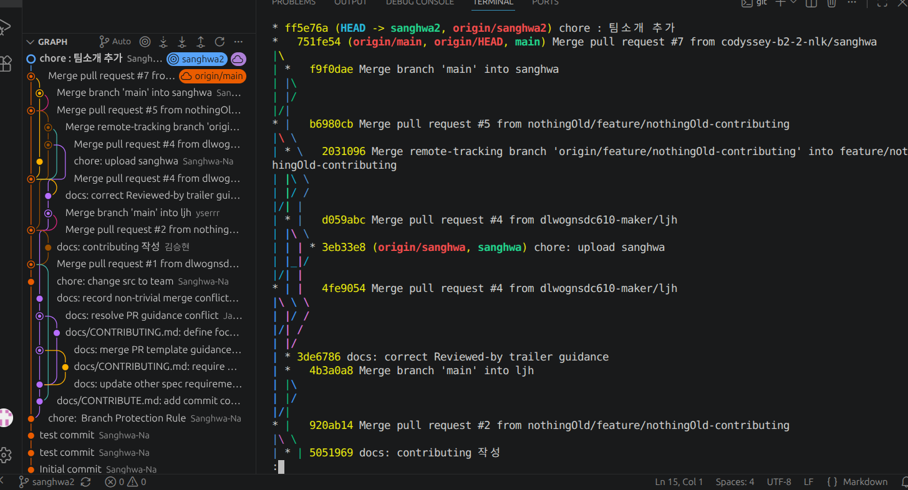

# team

팀 결과물과 구성원별 기여 내용을 이 디렉터리에 정리한다.

## 기여 기록

구성원별 결과물은 관련 커밋 또는 PR 링크와 함께 남긴다.
Team Git Collaboration Project

1. 프로젝트 소개

본 프로젝트는 3명의 팀원이 Git과 GitHub를 활용하여 협업 과정을 학습하기 위한 팀 프로젝트입니다.

GitHub Flow 기반의 브랜치 전략을 적용하고, Issue 생성부터 Pull Request, 코드 리뷰, 충돌 해결 및 병합까지의 협업 과정을 실습합니다.

복잡한 기능 개발보다는 팀원 간의 협업과 Git 워크플로우에 대한 이해를 목표로 합니다.

---

2. 팀 소개

팀원: 총 3명
마리너2기_나상화 <bdn980@gmail.com>
마리너2기_김승현 <sevencvter@gmail.com>
마리너_이재훈 <dlwognsdc610@gmail.com>

개발 환경: Git, GitHub

---

3. 협업 방식

브랜치 전략

GitHub Flow를 적용합니다.

main: 항상 정상적인 상태를 유지하는 기본 브랜치

feature/*: 팀원별 작업 브랜치

모든 변경 사항은 feature 브랜치에서 작업하며, Pull Request를 생성하여 코드 리뷰와 승인을 받은 후 main 브랜치에 병합합니다.

작업 절차

Issue 생성

feature 브랜치 생성

파일 작성 및 커밋

Pull Request 생성 및 Issue 연동

팀원 코드 리뷰 및 피드백 반영

승인 후 main 브랜치에 병합

